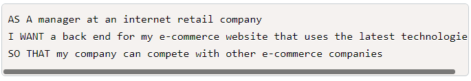
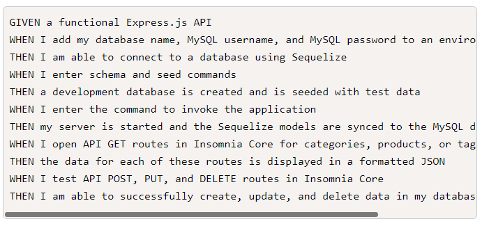
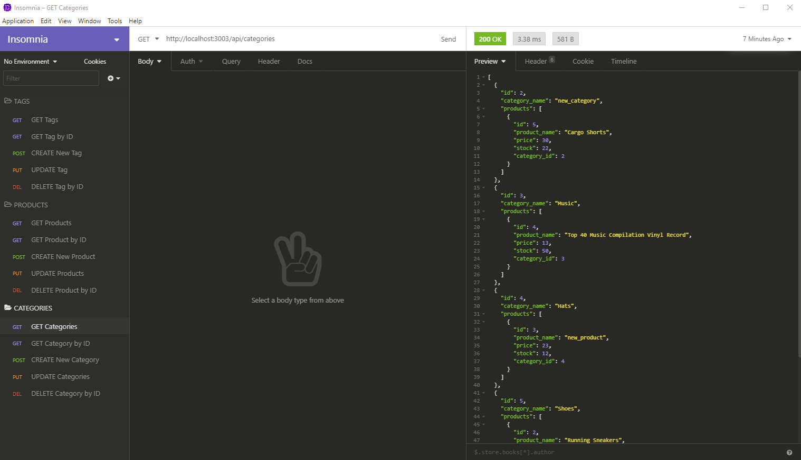
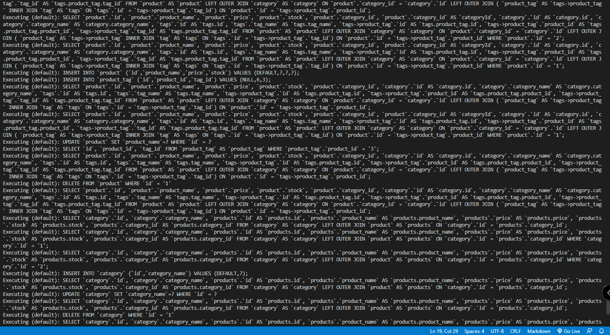

# E-commerce Back End Starter Code

## Description
This application provides access to Express Server and MySQL2 database for backend connection and data support. Application provides 4 models: Categories, Products, Product Tags, and Tags, and starting database Schema and Seeds. 

## GitHub Link
[E-Commerce GitHub Link](https://github.com/catse2000/e-commerce)

## Demo Recording Link
[Demo Recording Link](https://drive.google.com/file/d/1BNYoG-tg0CkZKYGjta1c5GFhIwofn-xL/view)

## User Story

## Acceptance Criteria

## Insomnia Screenshot

## SQL Server Run-Time Screenshot

